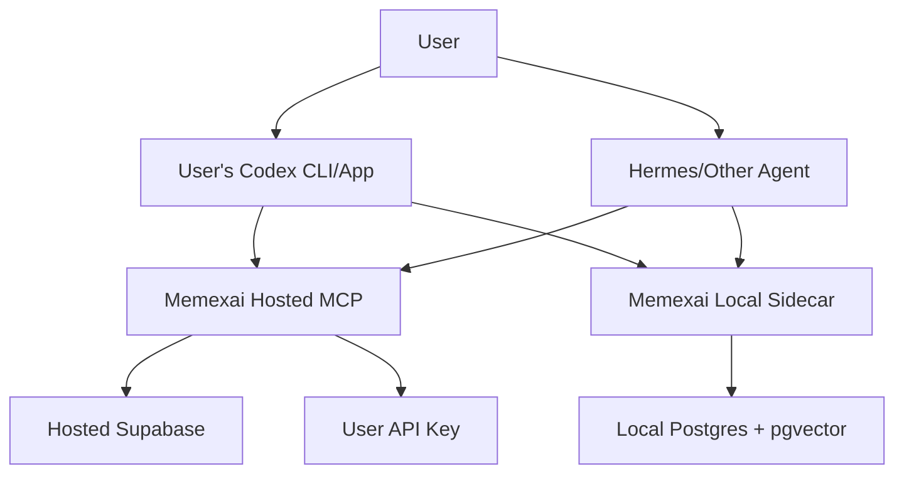

# BYO Agent Runtime And Storage

Status: future architecture note after Codex subscription/local-storage research, refreshed June 22, 2026

## Product Question

Can Memexai let a user bring their own agent runtime, model spend, and storage so the platform
does not always pay for hosted agent workflows, embeddings, or database usage?

The answer should be yes at the product-architecture level, but not by pretending every provider has
the same billing/auth model. Codex subscription access, API-key billing, local agents, and user-owned
databases need separate paths.

Decision after research:

- Keep hosted Supabase/Postgres/pgvector as the canonical default.
- Do not promise hosted "spend my ChatGPT/Codex subscription" workflows.
- Use remote MCP/ChatGPT App surfaces so users bring their own agent client.
- Use BYOK API billing for hosted backend model calls.
- Keep the read-only local Postgres/pgvector sidecar prototype as the first BYO storage path before
  offering a broad database picker.
- Treat user-owned Supabase/Neon/Postgres as advanced paths after the sidecar proves the sync
  contract.

## Current Codex Reality

OpenAI's current Codex docs describe two authentication modes:

- ChatGPT sign-in for subscription access.
- API key sign-in for usage-based access.

Codex Cloud requires ChatGPT sign-in, while Codex CLI and IDE can use either ChatGPT sign-in or an
API key. OpenAI also states that API-key Codex usage follows standard API pricing rather than
included ChatGPT plan credits. OpenAI's help docs separately state that ChatGPT Plus does not
include API usage and that ChatGPT subscription billing and API billing are managed separately.

A ChatGPT/Codex subscription is not an API credit pool that a third-party SaaS can automatically
draw from. Business/Enterprise Codex access tokens exist for trusted automation/local workflows, but
they are still sensitive workspace/user credentials and should not become the default public hosted
integration.

Implication: Memexai should not design the hosted app around "connect your Codex subscription
and let our server spend it" unless OpenAI ships a supported third-party delegated billing/OAuth
flow for that. The safer near-term product path is:

1. Let a user's own Codex CLI/app consume Memexai over MCP.
2. Publish Memexai as a ChatGPT App/remote MCP surface so ChatGPT can call our tools with
   explicit structured inputs.
3. Let a user's own OpenAI API key pay for hosted model calls when they opt in.
4. Let enterprise/trusted users bring Codex access tokens only in private automation contexts, not
   as a public SaaS default.

Official references:

- https://developers.openai.com/codex/auth
- https://developers.openai.com/codex/app-server
- https://developers.openai.com/codex/mcp
- https://developers.openai.com/apps-sdk/build/mcp-server
- https://help.openai.com/en/articles/6950777-what-is-chatgpt-plus
- https://help.openai.com/en/articles/8156019-how-can-i-move-my-chatgpt-subscription-to-the-api

## Recommended Modes

### Mode 1: Hosted Default

Memexai owns runtime and storage:

- Supabase Postgres/pgvector remains the hosted source of record.
- Platform-managed model calls run ingestion embeddings and source digestion.
- Users get quotas, dedupe, MCP tokens, playlist sync, and hosted web UI.

Best for normal users because setup is simple.

Risk: we pay for ingestion/model usage unless limits, paid plans, or BYOK cover it.

### Mode 2: BYOK Hosted Compute

Memexai owns orchestration/storage, user supplies provider API keys for expensive model calls:

- User can provide OpenAI/Gemini/etc. API keys.
- Hosted ingestion can use the user's key for embeddings or digest generation.
- Quotas still matter because database/storage and queue costs are ours.

Best near-term cost relief for hosted product.

Risk: secure key storage, user confusion between ChatGPT subscription and API billing, provider
rate-limit failures, support burden.

### Mode 3: User-Owned Codex Local Workflow

User runs Codex locally or in their own Codex environment, and Codex connects to Memexai MCP:

- Memexai provides MCP tools, prompts, and setup bundles.
- User's Codex subscription stays inside Codex CLI/app authentication.
- Codex calls Memexai for saved-video context and writes overlay notes.
- If Codex needs to run implementation work, it does that in the user's local repo or Codex cloud
  environment, not inside Memexai servers.

Best way to honor "use my Codex subscription" without touching private Codex credentials.

Risk: Memexai cannot guarantee the workflow ran, only provide MCP context and prompts unless
the local client reports status back.

### Mode 3b: ChatGPT App / Remote MCP

Memexai acts as a remote MCP server and optional ChatGPT App:

- The hosted service defines tools, prompts, output schemas, and concise `structuredContent`.
- ChatGPT/Codex/other MCP clients decide when to call the tools.
- The user's agent subscription is used by the user's agent client, not by our backend.
- Hosted side effects remain bounded: source context is read-only; ingestion requires `ingest:write`
  and bulk approval.

Best default for "agents can use this without a human constantly opening the web app."

Risk: ChatGPT/App clients need tight schemas and idempotent tools because the model may retry calls.

### Mode 4: Local-First Storage Sidecar

User runs a Memexai local sidecar:

- Local Postgres + pgvector is the preferred self-hosted DB.
- The local sidecar exposes an MCP server to Codex/Hermes/Claude/Cursor.
- Optional hosted account sync can send only compact metadata, capture-source definitions, or
  encrypted/portable exports.

Best for privacy-heavy users, local-agent power users, and people who want video knowledge on their
own machine.

Risk: installation complexity, migrations, backup/restore, local process uptime, YouTube API
credential setup, and support cost.

### Mode 5: User-Owned Supabase Project

User links their own Supabase project:

- We provide migrations and connection checks.
- Their database stores videos, chunks, concepts, overlays, MCP tokens, and usage metadata.
- Memexai hosted app can either connect to that project or the local sidecar can use it.

Best for advanced users who understand cloud databases.

Risk: RLS/security drift, schema migration failures, support ambiguity, and user-provided service
role secrets.

## Storage Recommendation

Ship BYO as a Postgres runtime choice, not a vector-store picker.

Near term:

- Keep hosted Supabase as default.
- Add BYOK model spend before adding BYO database selection in the normal onboarding flow.
- Keep iterating the read-only local Postgres/pgvector sidecar mirror as the first serious
  local/private storage option.
- Add user-supplied Supabase/Neon/Postgres support after the sidecar proves the sync contract.

Later:

- User-owned Supabase project for advanced cloud users.
- User-owned Neon/Postgres for users who want managed pgvector without Supabase Auth/RLS coupling.
- Qdrant/Chroma as optional vector sidecars only if pgvector becomes a bottleneck.
- SQLite/libSQL only for transcript/metadata cache or offline demo mode, not full parity, unless a
  reliable vector-search path is chosen.
- Cloudflare Vectorize/R2/D1 for edge gateway, archive, or specialized search experiments, not the
  first canonical permissioned store.

Not recommended for normal hosted onboarding:

- Asking users to pick a DB on signup.
- Letting random agents write directly to user databases.
- Storing raw Codex ChatGPT access tokens in Memexai cloud.

Why not a vector-store picker: Memexai's hard part is not vector search alone. It is canonical
YouTube videos, transcript chunks, access grants, source labels, source concepts, knowledge
artifacts, overlay notes, jobs, provenance, quotas, and MCP-safe tools. Postgres/pgvector keeps
vectors next to those relational joins and permission checks. Chroma/Qdrant can become sidecars
later, but they should not become the source of truth.

Official storage/runtime references:

- Supabase RAG permissions: https://supabase.com/docs/guides/ai/rag-with-permissions
- Supabase MCP: https://supabase.com/docs/guides/ai-tools/mcp
- Neon pgvector: https://neon.com/docs/extensions/pgvector
- Cloudflare Vectorize: https://developers.cloudflare.com/vectorize/

## Runtime Modes

### `hosted_supabase`

Current product default.

- Memexai manages Supabase, queues, workers, MCP tokens, and web auth.
- Best for normal users and public hosted onboarding.
- Quotas must protect platform model spend, DB storage, queue work, and transcript seconds.

### `byo_supabase`

User owns a Supabase project.

- Same Postgres/pgvector shape and most migrations.
- User owns DB billing and storage.
- Good first advanced cloud-storage path because it preserves Auth/RLS/pgvector assumptions.
- Requires migration runner, readiness checks, service-role-secret handling, and support boundaries.

### `local_postgres`

User runs a local sidecar.

- Docker/desktop bundle with FastAPI, local MCP, Postgres, and pgvector.
- Replace Supabase Auth dependency with a stable local profile/workspace ID.
- Keep `user_videos` and `user_channels` so provenance remains identical.
- Use app-enforced access first; later add Postgres RLS with session variables if needed.

### Storage Options Compared

| Option                    | Verdict                 | Why                                                                                                           |
| ------------------------- | ----------------------- | ------------------------------------------------------------------------------------------------------------- |
| Hosted Supabase           | Default                 | Lowest-friction web product with auth, RLS, pgvector, jobs, and MCP tokens in one place.                      |
| Local sidecar mirror      | First BYO prototype     | Lets agents search local granted context without moving canonical hosting or credentials too early.           |
| Local Postgres + pgvector | First local/private DB  | Closest to hosted architecture while keeping data on the user's machine.                                      |
| User-owned Supabase       | Later BYO cloud path    | Same schema family and low migration complexity; user owns cloud DB billing, but support/security are harder. |
| User-owned Neon/Postgres  | Later BYO cloud path    | Portable pgvector with managed Postgres; requires separate auth, RLS, and migration discipline.               |
| SQLite/libSQL             | Later single-user vault | Portable, but would fork JSONB, Postgres RPCs, RLS assumptions, full-text behavior, and migrations.           |
| Chroma/Qdrant             | Later vector sidecar    | Useful retrieval engines, but not enough for canonical source truth, grants, overlays, jobs, and provenance.  |
| Local-only MCP server     | Packaging layer         | Agent UX over local storage, not a database choice by itself.                                                 |

## Schema Split Needed

To support BYO Supabase and local Postgres without duplicating the whole backend, split migrations and
helpers conceptually:

- `core_postgres`: videos, chunks, transcript lines, labels, concepts, edges, artifacts, overlays,
  jobs, MCP tokens, grants, workflows.
- `supabase_auth`: `auth.users`, `auth.uid()`, JWT validation, hosted RLS policies.
- `local_auth`: local workspace/profile table, local MCP token or OS-level trust, app-enforced user
  ID, optional RLS later.

This split keeps user-visible semantics stable while letting deployment/auth differ.

## Architecture Shape

## Product UX

Offer this as "Where should your video brain run?"

- Hosted: easiest, managed, quotas apply.
- Hosted + my API key: managed storage, my model spend.
- My Supabase project: my cloud database, advanced setup.
- Local sidecar: my machine, my Postgres, my agents.

For Codex specifically, Settings should say:

- "Use Memexai from Codex" means configure Codex MCP with the user's Memexai token.
- "Use my Codex subscription" means run Codex in the user's own Codex app/CLI/cloud environment.
- Hosted Memexai cannot currently spend a user's ChatGPT/Codex subscription from our servers.
- For hosted model calls inside Memexai, use BYOK API billing rather than ChatGPT plan credits.

## Implementation Slices

1. Add BYO runtime/storage decision record and surface it in agent-first roadmap.
2. Add a Codex setup bundle beside Hermes setup:
   - `~/.codex/config.toml` MCP snippet.
   - first calls: `get_mcp_session`, `get_agent_quickstart`, `get_brain_sync_contract`.
   - guidance that Codex runs under the user's own auth.
3. Add BYOK model-spend controls for digestion depth and embeddings.
4. Add read-only local sidecar mirror. Prototype exists:
   - sync only user-granted videos/chunks/concepts/artifacts/notes.
   - expose `list_video_library`, `search_video_moments`, `get_video_context`, and `sync_status`
     over local MCP.
   - preserve access provenance and avoid broad global corpus export.
   - prototype artifact: [LOCAL_SIDECAR.md](LOCAL_SIDECAR.md) and
     [../scripts/local_sidecar_digest.py](../scripts/local_sidecar_digest.py) convert compact MCP
     brain digests into JSONL and idempotent local Postgres/pgvector SQL.
5. Add user-owned Supabase/Neon/Postgres project path:
   - connection verifier
   - migration runner
   - service-role secret storage guidance
   - schema version check
6. Add local Postgres sidecar ingestion prototype:
   - Docker Compose for Postgres + pgvector.
   - Local MCP server.
   - local workspace/profile identity.
   - Playlist/manual URL ingestion.
   - Export/import with hosted account.
7. Add sync contract between hosted and local:
   - source IDs
   - access grants
   - overlay notes
   - cursors
   - conflict rules

## Open Questions

- Should local sidecar be a separate package or the same FastAPI app with `SEARCHTUBE_STORAGE=local_postgres`?
- Should hosted accounts be allowed to read from user-owned DBs, or should user-owned DBs only expose MCP locally?
- What is the minimum useful local install: Postgres only, or Postgres plus a worker?
- Can a future OpenAI-supported delegated Codex OAuth flow safely let hosted apps trigger user-paid
  Codex work without handling access tokens?
